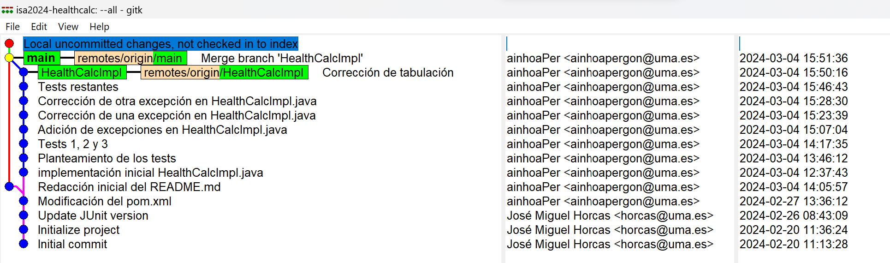
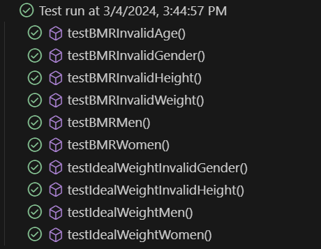
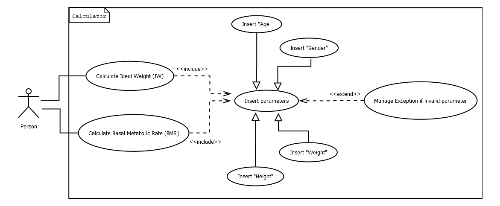
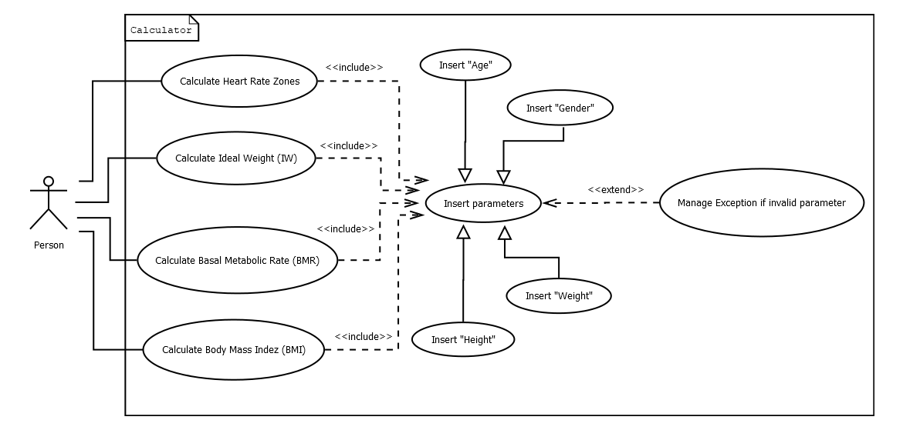
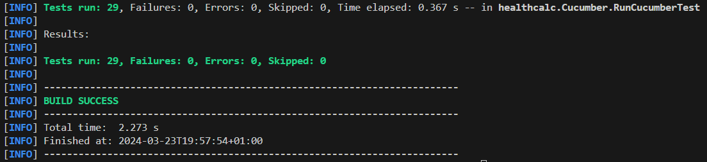

# Health calculator
  
- **Project title: isa2024-healtcalc**
- **Author: Ainhoa Pérez González**

# Practice 1

This calculator is designed to calculate *ideal weight* and *Basal Metabolic Rate (BMR)* for an individual.
We have two methods in our java class HealthCalcImpl.java for each calculation: idealWeight() and basalMetabolicRate().

All the possible input parameters are:
- Height (in centimeters).
- Gender ('m' for man and 'w' for woman).
- Weight (in kilograms).
- Age (in years).

Both methods handle possible exceptions (errors) if the individual has any invalid parameter (explained ahead in the **Health Calculator Test Cases section**)

# Repository state

This repository has the following structure:
- Main branch which contains the final code.
- HealthCalcImpl branch which contains every changes or corrections on both tests and the main java class codes.

Here is the diagram with all the "commits" used:

(All the images uploaded into GitHub were also a commit named "Subida de fotos para completar archivo README.md" but this
last commit was done after taking the screenshot. Also the final commit to post the final "README.md" is called "Actualización README.md").

# Health Calculator Test Cases

This section outlines the test cases for the Health Calculator.

Here is a short explanation of each one:

## Ideal Weight Calculation

- **Test Case 1: Ideal Weight for Men**
  - Description: Calculate the ideal weight for a man based on his height.
  - Input: Height (in centimeters) and male gender character ('m').
  - Expected Output: Ideal weight (in kilograms).

- **Test Case 2: Ideal Weight for Women**
  - Description: Calculate the ideal weight for a woman based on her height.
  - Input: Height (in centimeters) and female gender character ('w').
  - Expected Output: Ideal weight (in kilograms).

- **Test Case 3: Invalid Height for Ideal Weight**
  - Description: Ensure the calculator throws an error when an invalid height is entered.
  - Input: Negative or zero values for height.
  - Expected Outcome: An error message indicating the height is invalid.

- **Test Case 4: Invalid Gender for Ideal Weight**
  - Description: Ensure the calculator throws an error when an invalid gender is entered.
  - Input: Invalid gender character (other than 'm' or 'w').
  - Expected Outcome: An error message indicating the gender is invalid.

## Basal Metabolic Rate Calculation

- **Test Case 5: Basal Metabolic Rate for Men**
  - Description: Calculate the BMR for a man based on his weight, height, and age.
  - Input: Weight (in kilograms), height (in centimeters), gender ('m'), age (in years).
  - Expected Output: BMR value.

- **Test Case 6: Basal Metabolic Rate for Women**
  - Description: Calculate the BMR for a woman based on her weight, height, and age.
  - Input: Weight (in kilograms), height (in centimeters), gender('w'), age (in years).
  - Expected Output: BMR value.

- **Test Case 7: Invalid Gender for BMR**
  - Description: Ensure the calculator throws an error when invalid gender is entered for BMR calculation.
  - Input: Invalid gender character (other than 'm' or 'w').
  - Expected Outcome: An error message indicating that gender is invalid.

- **Test Case 8: Invalid Age for BMR**
  - Description: Ensure the calculator throws an error when invalid age is entered for BMR calculation.
  - Input: Negative or zero values for age.
  - Expected Outcome: An error message indicating that age is invalid.

- **Test Case 9: Invalid Height for BMR**
  - Description: Ensure the calculator throws an error when invalid height is entered for BMR calculation.
  - Input: Negative or zero values for height.
  - Expected Outcome: An error message indicating that height is invalid.

- **Test Case 10: Invalid Weight for BMR**
  - Description: Ensure the calculator throws an error when invalid weight is entered for BMR calculation.
  - Input: Negative or zero values weight.
  - Expected Outcome: An error message indicating that weight is invalid.

# Practice 2

In this practice we will be seeing the use cases for our calculator. The use cases diagram is a method for describing the functional requirements of a system from the perspective of its users. In this diagram we see the actors and the actions we can achieve using the system.

I will be using **Dia Diagram Editor** to create my diagrams (it is a free software).

## Use cases - First diagram

In this first diagram we can see that the person (actor) can use the system to calculate the ideal weight or the basal metabolic rate (BMR). In order to do that, the person must enter the parameters needed for every calculation (for example, when calculating ideal weight, the person must enter height and gender). The system will handle the possible errors when entering a wrong parameter (for example, when entering a negative age).

### Use case: Calculate Basal Metabolic Rate (BMR)

In this section I will be specifying some aspects for the use case for calculating the basal metabolic rate in our calculator.

- **Use Case Name**: Calculate Basal Metabolic Rate (BMR)
- **Primary Actor**: Person
- **Scope**: Health Calculator Application
- **Level**: User-goal level
- **Stakeholders and interests**:
  - A person who wants to know their BMR for a fitness planning.
  - A nutritionist or other health professional that find useful calculating BMR to provide dietary or exercise guidance.
- **Preconditions**: The calculator application is operational and accesible to the person.
- **Minimum guarantees**: The calculator will not crash and will handle invalid parameters.
- **Success guarantees**: The BMR will be calculated correctly according to the provided inputs.
- **Main success Scenario**: The person introduces valid parameters and the calculator displays the person's BMR.
- **Alternate Scenario**: The person introduces invalid parameters and the calculator shows an error.
- **Possible Extensions**: The calculator could allow the person to log in and save their data for future use.

## Use cases - Second diagram

Now I will be creating another use cases diagram but implementing two more possible use cases. The calculator could be able to calculate the ideal weight, basal metabolic rate (BMR), heart rate zones and Body Mass Index (BMI). **Heart rate zones** are typically calculated using a person's maximum heart rate (MHR) and resting heart rate (RHR). However, MHR can be estimated only using age if the actual max heart rate is not known. The **BMI** can be calculated using weight and height, knowing that the formula is weight(kg)/height^2(m). So it won't be necessary to add more parameters to our calculator. The second use cases diagram implementing those new cases should look like:

# Practice 3

## User Stories for Health Calc

### User Story 1: Ideal Weight Calculation

- As a **person using the calculator**
- I want **to calculate my ideal weight**
- So that **I can establish a fitness planning based on my results**

*Acceptance Criteria:*

* First Scenario:
  - **Given**: an user that enters correctly their height and gender.
  - **When**: the user requests to calculate the ideal weight.
  - **Then**: the calculator returns the ideal weight according to their data.
    
* Second Scenario:
  - **Given**: an user that enters valid height and invalid gender.
  - **When**: the user requests to calculate the ideal weight.
  - **Then**: the calculator returns an error message saying "Invalid Gender".

* Third Scenario:
  - **Given**: an user that enters invalid height and valid gender
  - **When**: the user requests to calculate the ideal weight
  - **Then**: the calculator returns an error message saying "Invalid Height"

### User Story 2: Basal Metabolic Rate (BMR) Calculation

- As a **person using the calculator**
- I want **to calculate my BMR**
- So that **I can establish a diet with the calories I should consume to maintain my current weight**

*Acceptance Criteria:*
    
* First Scenario:
  - **Given**: an user that enters correctly weight, height, gender and age.
  - **When**: the user requests to calculate BMR.
  - **Then**: the calculator returns the BMR according to their data.
    
* Second Scenario:
  - **Given**: an user that enters valid weight, height, gender but invalid age.
  - **When**:  the user requests to calculate BMR.
  - **Then**: the calculator returns an error message saying "Invalid Age".
    
* Third Scenario:
  - **Given**: an user that enters valid weight, height, age but invalid gender.
  - **When**:  the user requests to calculate BMR.
  - **Then**: the calculator returns an error message saying "Invalid Gender".
    
* Fourth Scenario:
  - **Given**: an user that enters valid weight, age, gender but invalid height.
  - **When**: the user requests to calculate BMR.
  - **Then**: the calculator returns an error message saying "Invalid Height".
    
* Fifth Scenario:
  - **Given**: an user that enters valid height, age, gender but invalid weight.
  - **When**: the user requests to calculate BMR.
  - **Then**: the calculator returns an error message saying "Invalid Weight".

## BDD Tests using Cucumber

We have two feature archives for every user story: "bmr.feature" and "idealw.feature". Also we have the Step Definitions according to each scenario.

In file "output_tests.txt" inside "doc", we can check out the exit in console when running the BDD tests using cucumber:

 

